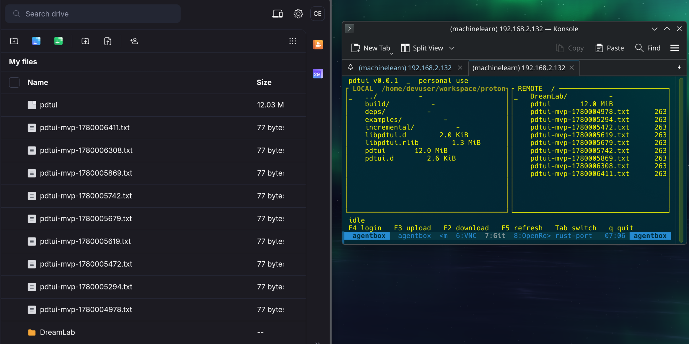

# Rust port — `proton-drive` + `pdtui`

Personal-use Rust port of the Proton Drive SDK plus a two-pane tmux-ready TUI.
Scope and decisions live in [`../docs/PRD-rust-port-and-tui.md`](../docs/PRD-rust-port-and-tui.md),
[`../docs/adr/`](../docs/adr/), and [`../docs/domain-model.md`](../docs/domain-model.md).

> **⚠️ Working MVP — NOT audited. Use at your own risk.**
>
> This is a functional MVP: SRP login, folder listing, and a byte-identical
> upload/download round-trip work against the live Proton Drive API. It has
> **not** undergone a security audit or independent cryptographic review, and
> it is **not** an official Proton product.
>
> Proton Drive users should **not** expect this to work without risks or bugs.
> The crypto and wire-format paths were reverse-engineered against the JS SDK
> and validated by round-trip only — edge cases, error handling, and concurrent
> access are largely untested. Do not rely on it for data you cannot afford to
> lose or expose. No warranty of correctness, durability, or confidentiality.



`pdtui` (right) beside the official Proton Drive web UI (left): the same
`pdtui-mvp-*.txt` files appear in both panes, uploaded and downloaded
byte-identically through the live Proton API.

## Layout

```
rust/
├─ crates/
│  ├─ proton-drive             # public facade (re-exports)
│  ├─ proton-drive-core        # client, nodes, events, transfer
│  ├─ proton-drive-api         # HTTP DTOs (M1: codegen from cs/sdk protos)
│  ├─ proton-drive-crypto      # OpenPgpCrypto trait + rpgp impl (M2)
│  ├─ proton-drive-cache       # ProtonDriveCache trait + MemoryCache
│  └─ proton-drive-telemetry   # Telemetry trait + NullTelemetry
└─ apps/
   └─ pdtui                    # two-pane TUI binary
```

## Build

```bash
cargo check --workspace
cargo clippy --workspace --all-targets -- -D warnings
cargo build -p pdtui
```

## Current state (v0.1.0 — unaudited MVP)

- ✅ Workspace scaffolded, all crates compile
- ✅ Trait surface mirrors JS `interface/` 1:1
- ✅ Error taxonomy, config, value objects in place
- ✅ pdtui skeleton with keymap dispatch and ratatui rendering
- ◐ M1: protobuf codegen in `proton-drive-api` (build-time, from `cs/sdk/protos`).
  OpenAPI codegen deferred — REST DTOs stay hand-written until the specs are
  vendored into this repo.
- ✅ M2: `rpgp` bodies in `proton-drive-crypto` (SEIPDv1 path), SRP verifier,
  SKESK password session keys
- ✅ M3: real `my_files_root` / `iter_folder_children` against the API
- ✅ M4/M5: upload + download (byte-identical round-trip)
- ✅ M6: event subscription (volume light-events v2 polling loop)
- ✅ M7: pdtui v0.1.0

Known gaps: nested-file download (root-level only), and the items in the
unaudited-MVP disclaimer above. See PRD §8 for the milestone table.
